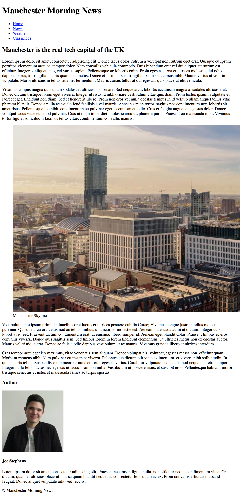
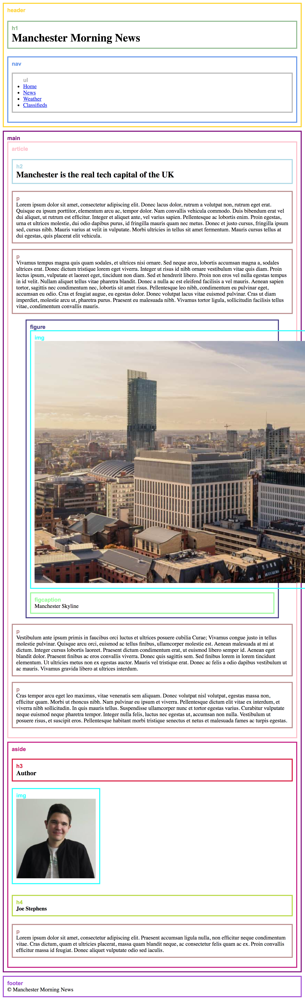

## HTML Exercise

Recreate the below news webpage (use your own images from Google):

There are guides and tag names to assist you as to what tags you should use where your opening and closing tags should be:

Remember, you want all of your page content to go inside your `body` tags. Please try and follow the structure as closely as possible, as we'll be styling the finished page in the CSS exercise. 

### Useful Links

* [Lorem Ipsum Generator](http://www.lipsum.com/)
* [List of HTML5 elements](https://developer.mozilla.org/en-US/docs/Web/HTML/Element)
