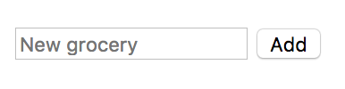

# Shopping List

What we will be making
------
We will create a shopping list which we can add groceries to.

For this walkthrough, each person in the pair/group of three will have their own remote (GitHub repository).

Preparation - both pairs to do this
------
In the command line, change directory into your **Projects** folder and create a new folder called **shoppingList**.  

Change directory into this folder and initialise a local Git repository (hint: `git init`).

On GitHub, add a new repository (the + icon). Give your repository the same name as your folder (shoppingList). **Don't** tick the checkbox for "Initialize this repository with a README". Click **Create repository**.

Now you need to link your *local* repository to your *remote* repository (replacing `<username>` with your username):

```bash
git remote add origin https://github.com/<username>/shoppingList
```

Verify your remote is set up correctly with `git remote -v`.

:twisted_rightwards_arrows: **Time to pair. Choose between you who is to be driver and navigator first. The person driving shouldn't need to look at the walkthrough - it is the job of the navigator to instruct the driver as to what to do (and to ensure they're using the correct terminology)!**

Create the index.html file
------
1) Create an **index.html** file (in the command line with `code`), save the file, and populate the basic HTML structure (`!` then `Tab`). 

2) Inside your `body` tags, add a pair of opening and closing `script` tags. 

3) Give the opening tag an attribute of `type` with the value `text/javascript`.

You should have the following:

```html
<!DOCTYPE html>
<html lang="en">
<head>
  <meta charset="UTF-8">
  <meta name="viewport" content="width=device-width, initial-scale=1.0">
  <meta http-equiv="X-UA-Compatible" content="ie=edge">
  <title>Document</title>
</head>
<body>
  <script type="text/javascript">

  </script>
</body>
</html>
```

4) Now we want to take the **index.html** file from our *working tree* and *stage* it to our *index*: 
```
git add index.html
```

5) Now **commit** the changes to the *local* repository: `git commit -m "initial commit"` (*initial commit* is a common first commit message). 

6) Finally, push the changes to your *remote*. As this is your first commit you have to tell GitHub which branch you want to push up. You should be working on **master** so you can set the upstream to this on your first push: 

```
git push -u origin master
```

***
:bulb:

The `-u` set's the upstream to `origin master`. In future you can just use `git push` as you've already set the upstream.
***

:twisted_rightwards_arrows: **Driver and Navigator switch roles**

Partner pulls
------

1) Firstly the person who is now driving will need to pull their partner's changes. To do this, they will need to add their partner's GitHub repo as a *remote* (replacing `<partnersUsername>` with your partner's GitHub username):
```
git remote add <partnersUsername> https://github.com/<partnersUsername>/shoppingList
```

2) Now do `git pull <partnersName> master` to pull from your partner's master branch.

HTML Forms
------
We're going to handle adding and displaying grocery items inside the document (no prompts or alerts). To do this we need to create a HTML form. A form usually made up of one or many of the following: text inputs; text areas; checkboxes; radio buttons; dropdowns; and buttons (which usually submit the form).

1) Inside the `body` tags, before the opening/closing `script` tags, add a new pair of opening and closing `form` tags. Give the opening `form` tag an attribute of `method` with the value `post`, and an attribute of `id` with a value of `addGroceryForm`.

2) Inside the `form` tags - on a new line - create an `input` tag. This tag is self-closing so no closing tag is required. Give it an `id` attribute with the value `groceryInput`, a `type` attribute with the value `text` and a `placeholder` attribute with the value `New grocery`.

3) Still inside the `form` tag, after the `input` tag, add an opening and closing `button` tag. Give the opening tag a `type` attribute with the value `submit`. Between the tags type `Add` for the button's text.

4) Save the file and open it up in your browser. You should see:



```html
<form id="addGroceryForm" method="post">
  <input id="groceryInput" type="text" placeholder="New grocery">
  <button type="submit">Add</button>
</form>
```

5) Stage your changes: 
```
git add index.html
```

6) Commit to local repository: 
```
git commit -m "created form for adding groceries"
```

7) Now you'll need to set the upstream origin to your *remote* repository, as you pulled down from your partner's previously: 
```
git push -u origin master
```

:twisted_rightwards_arrows: **Driver and Navigator switch roles**

[Next: Handling Form Input](part2.md)